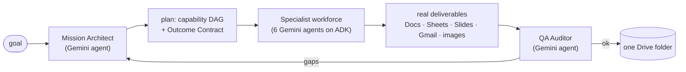

# NEXORA

**One goal in. A verified workspace of real work out.**

NEXORA is an autonomous **goal compiler**. You give it a messy, real-world
objective in plain language — *"I'm in New York tomorrow, what should I see? Put
together a guide, a slide deck and a budget"*, *"read today's email and brief me
on what matters"*, *"every weekday at 7am, prep my standup from my calendar and
inbox"* — and a workforce of **Gemini 3.5 agents on Google's ADK** plans the
work, does it in the background, **checks that the result actually satisfies the
goal**, repairs the gaps, and hands back one Google Drive folder of finished,
nicely‑formatted deliverables.

Built for the **Taskmaster** track of the All Things Agentic Hackathon:
high‑value autonomous execution of multi‑step work, not a chat box.

- **Live demo:** _add your Cloud Run URL here_
- **Demo video:** _add your YouTube link here_
- **Architecture:** [docs/ARCHITECTURE.md](docs/ARCHITECTURE.md)

---

## The friction

Knowledge work is full of tasks that are *individually* simple and *collectively*
exhausting: research something, write it up, build the spreadsheet, make the
deck, draft the email, schedule the meeting, file it all somewhere sensible, and
double‑check nothing was missed. Every step is a context switch. NEXORA collapses
the whole arc into a single instruction and returns verified output.

---

## How it works



1. **Mission Architect** (a Gemini agent) turns the goal into an **Outcome
   Contract** — a formal, checkable definition of success — and compiles a
   dependency graph of *capabilities* validated against a capability registry.
2. The **specialist workforce** — Research Analyst, Writer, Financial Analyst,
   Designer, Coordinator, Visual Designer, each a `google.adk` agent — executes
   the graph in parallel. Gemini writes the actual document body, slide copy and
   costed spreadsheet rows from the gathered evidence; the Google Workspace APIs
   render them with real headings, bullets, currency formatting and a branded
   HTML email.
3. **Web research** is Gemini + Google Search grounding — real, cited facts.
4. The **QA Auditor** (a Gemini agent) reads the produced artifacts and rules,
   per deliverable, `SATISFIED` / `PARTIAL` / `MISSING`. Gaps trigger a bounded
   adaptive replan.
5. Everything lands in one **Mission Workspace** Drive folder.

Throughout: a **Content Firewall** scans every external string (emails, web
results) for prompt‑injection before a model sees it; a **policy engine** puts
irreversible actions (sending mail) behind human approval — a mission can pause
there for days; every action writes an **ActionReceipt** and an audit entry.

**Standing instructions.** A goal can be scheduled (`once` / `daily` /
`weekdays` / `weekly` / `monthly`). The mission for next Monday doesn't exist
until Monday — Cloud Scheduler fires due schedules every minute.

---

## Gemini is the engine

Every reasoning step is Gemini 3.5, run as an agent on the **Google ADK**:

| Agent | Job |
| --- | --- |
| Mission Architect | Outcome Contract + plan compilation |
| Research Analyst / Writer / Financial Analyst / Designer / Coordinator / Visual Designer | produce each deliverable |
| QA Auditor | verify deliverables against the contract |

The model runs through **Vertex AI** in production (`NEXORA_LLM_BACKEND=vertex`,
Gemini on the `global` endpoint) or the Gemini API locally. Deterministic
fallbacks exist only so a mission degrades gracefully instead of crashing when a
backend is unreachable — they are the safety net, not the default path.

---

## Meets the hackathon requirements

| Requirement | How |
| --- | --- |
| **Gemini 3.5+** | `gemini-3.5-flash` drives the Architect, the six specialists, the Auditor, research synthesis, and screenshot vision. |
| **A Google agent framework** | **Google ADK** (`google-adk`) runs every agent; the **GenAI SDK** (`google-genai`) is the model transport and does Google‑Search‑grounded research and image generation. |
| **A Google Cloud service** | **Cloud Run** (service), **Firestore** (mission state), **Cloud Tasks** (one durable task per plan node), **Cloud Scheduler** (standing instructions), **Vertex AI** (Gemini + image models). |
| **Multimodal / extra models (bonus)** | Gemini image generation, Gemini Vision (screenshot triage), Veo (video), Lyria (audio) — invoked when the contract calls for them. |
| **Hosted + reproducible** | `Dockerfile` + one‑command `infrastructure/deploy.sh` + Terraform. |

---

## Quickstart (local)

**Prereqs:** Python 3.12, Node 20, a Gemini API key
([aistudio.google.com/apikey](https://aistudio.google.com/apikey)).

```bash
cd apps/api
python -m venv venv && source venv/bin/activate      # Windows: venv\Scripts\activate
pip install -r requirements.txt
cp .env.example .env                                  # add your GEMINI_API_KEY

cd ../..
PYTHONPATH=. apps/api/venv/bin/python -m uvicorn nexora.main:app --reload --port 8000 --app-dir apps/api
```

```bash
cd apps/web && npm install && npm run dev             # http://localhost:3000
```

Open http://localhost:3000, pick a scenario or type a goal, hit **Launch**.
`MOCK` needs only the Gemini key; `LIVE` also needs Google OAuth (below).

Tests (fully hermetic, no keys):

```bash
cd apps/api && PYTHONPATH=../.. venv/bin/python -m pytest -q
```

### LIVE mode (real Google Workspace)

1. Create an OAuth 2.0 Web client in Google Cloud console, redirect URI
   `http://localhost:8000/api/v1/auth/callback`.
2. `GOOGLE_CLIENT_ID` / `GOOGLE_CLIENT_SECRET` in `apps/api/.env`,
   `EXECUTION_MODE=LIVE`.
3. Visit `http://localhost:8000/api/v1/auth/google`, approve.
4. Launch a mission — deliverables land in a real Drive folder.

---

## Deploy to Google Cloud

```bash
PROJECT_ID=your-project GEMINI_API_KEY=xxxxx ./infrastructure/deploy.sh
```

Enables the APIs; creates Firestore, the `nexora-workers` Cloud Tasks queue, the
`nexora-run-due` Cloud Scheduler job, an Artifact Registry repo and a
least‑privilege service account; puts the Gemini key in Secret Manager; builds
with Cloud Build; deploys to Cloud Run; wires `NEXORA_WORKER_URL` back. Terraform
equivalent in [infrastructure/terraform](infrastructure/terraform). The deployed
service defaults to Vertex AI, Firestore, Cloud Tasks dispatch.

---

## Repository layout

```
apps/
  api/                     FastAPI service — the mission engine
    nexora/
      core/                contract, compiler, composer, semantic_verifier,
                           adk_runtime, scheduler, security (firewall),
                           policy_engine, llm_client, task_dispatcher, repository
      agents/              node_executor, supervisor, critic, replanner, interpreter
      providers/           MOCK / LIVE (Google Workspace) / ACME_LABS / REPLAY,
                           formatting.py (Docs/Slides/Sheets/HTML rendering)
      main.py              REST + WebSocket API
    tests/                 142 hermetic tests (test_phase*.py)
  web/                     Next.js Command Center UI
packages/core/models.py    shared Pydantic domain models
infrastructure/            Dockerfile context, deploy.sh, Terraform
docs/ARCHITECTURE.md       the diagram + component walk-through
docs/adr/                  69 architecture decision records
```

Read first: `apps/api/nexora/main.py` (`create_mission` orchestration) ·
`nexora/core/adk_runtime.py` (the agent workforce) · `nexora/core/composer.py`
(how deliverables get real content) · `nexora/providers/formatting.py` (how they
get formatted) · `nexora/agents/supervisor.py` (verify + replan) ·
`nexora/core/security.py` (firewall).

---

## What we're proud of

- **Success is a contract, not a status code.** A Gemini agent writes a checkable
  definition of done; an independent Gemini agent verifies the *artifacts*
  against it and re‑plans what's short.
- **The deliverables are real and they look designed.** The New York demo
  produces a formatted, day‑by‑day costed itinerary doc, a themed deck, a
  currency‑formatted budget sheet and a generated photo — verified end‑to‑end
  against a real Google account.
- **A real agent pipeline.** Architect → six specialists → Auditor, all on ADK —
  not one prompt doing everything.
- **Untrusted‑input discipline.** Every external string is firewall‑scanned; the
  demo inbox contains a malicious email and you can watch it get quarantined.
- **Same code, laptop or cloud.** Repository, dispatcher, scheduler, provider and
  model backend are all interfaces with a local and a Google Cloud
  implementation.

## Known limits / roadmap

- Schedules and mission state are in memory until wired to Firestore (the
  repository already supports it).
- `web.research` grounding is Gemini + Google Search; a dedicated search vendor
  would broaden coverage.
- Organizational memory is scoped + substring‑matched; vector retrieval is next.
