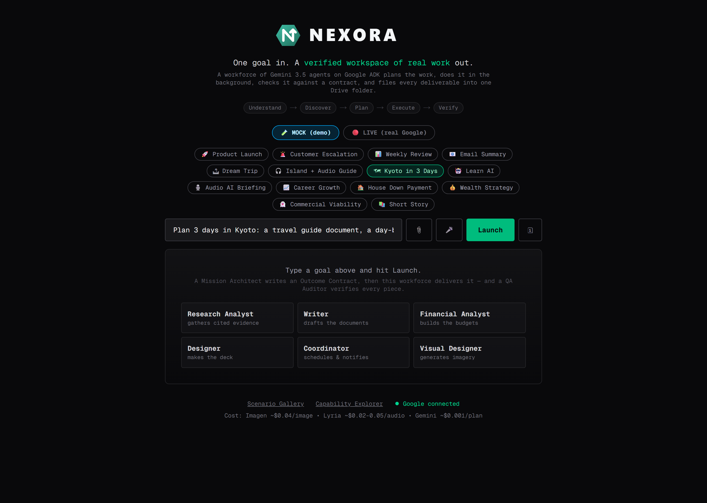
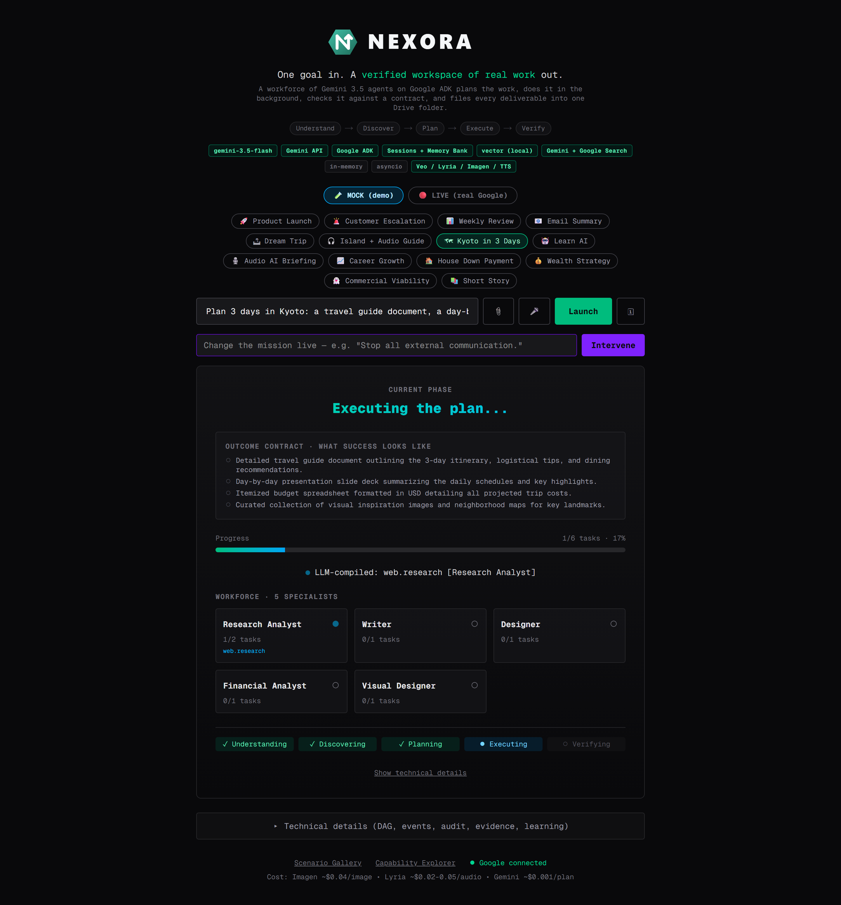
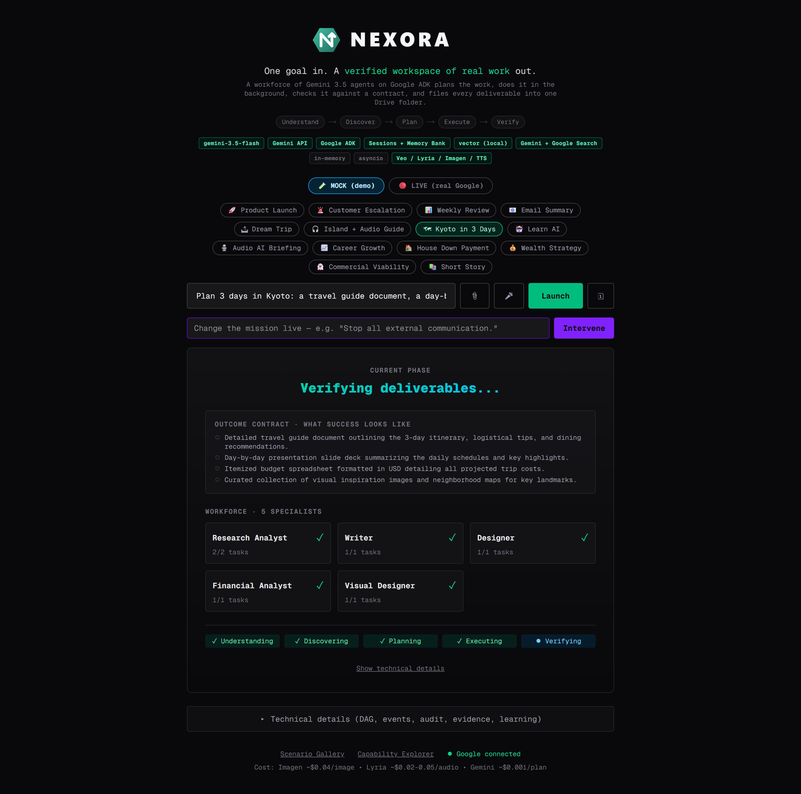
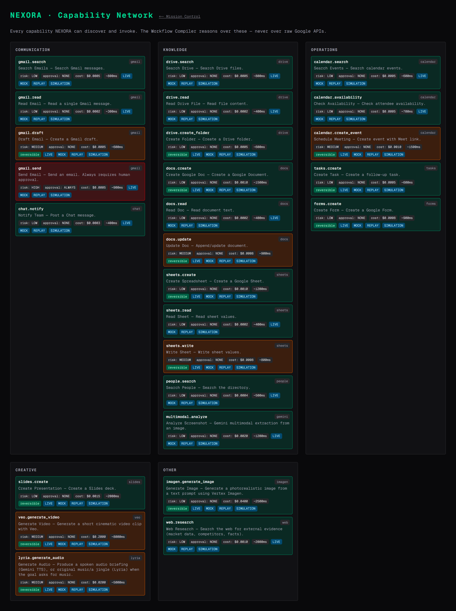

<div align="center">

<picture>
  <source media="(prefers-color-scheme: dark)" srcset="docs/brand/wordmark-dark.svg">
  
</picture>

**An autonomous goal compiler. One goal in — a verified workspace of real work out.**

*All Things Agentic Hackathon — **Taskmaster** track*

[Live demo](https://nexora-nexus.vercel.app) · [Demo video](#) · [Demo script](docs/DEMO.md) · [Architecture](#architecture) · [Try it offline](#run-it-locally)


</div>

---

## Hackathon requirements — at a glance

**Every mandatory requirement is met, and every point is proven with a link or a one‑command check.**

| Requirement | ✅ NEXORA uses | Where |
|---|---|---|
| **Gemini 3.5 or newer** | `gemini-3.5-flash` — the Architect, all 6 workforce agents, the QA Auditor, research synthesis, screenshot vision, and doc/slide/sheet composition | [`llm_client.py:66`](apps/api/nexora/core/llm_client.py#L66) · `NEXORA_MODEL_T2` in [`.env.example`](apps/api/.env.example) |
| **A Google agent framework** | **Google ADK** (`google-adk`) — every reasoning turn is an ADK `LlmAgent` run through an ADK `Runner`; **Google GenAI SDK** (`google-genai`) is the model transport | [`adk_runtime.py:90`](apps/api/nexora/core/adk_runtime.py#L90) |
| **Google agent platform (preferred)** | **Vertex AI Agent Engine** — the ADK Runner uses `VertexAiSessionService` (managed Sessions) + `VertexAiMemoryBankService` (managed Memory Bank) on a real `reasoningEngines/…` instance | [`adk_runtime.py:65`](apps/api/nexora/core/adk_runtime.py#L65) · [`deploy_agent_engine.py`](infrastructure/deploy_agent_engine.py) |
| **A Google Cloud infrastructure service** | **Cloud Run** (the service), **Firestore** (mission + schedule state), **Cloud Tasks** (one retried task per plan node), **Cloud Scheduler** (standing goals), **Secret Manager** (keys) | [`deploy.sh`](infrastructure/deploy.sh) · [`terraform/`](infrastructure/terraform) |
| **Model on Vertex AI** | Gemini runs through Vertex AI in production (`NEXORA_LLM_BACKEND=vertex`, `genai.Client(vertexai=True)`), plus Vertex `text-embedding-005` for vector memory | [`llm_client.py:140`](apps/api/nexora/core/llm_client.py#L140) |
| **Hosted + reproducible** | `Dockerfile` + one‑command `infrastructure/deploy.sh` + Terraform; 154 hermetic tests | [`Dockerfile`](Dockerfile) |
| **Multimodal** | voice input; screenshot analysis (Gemini Vision); generated images, video, audio | see below |

### Bonus — additional Google AI models

| Model | What NEXORA does with it | Where |
|---|---|---|
| **Veo 3.1 Fast** (`veo-3.1-fast-generate-001`) | generates a short cinematic clip for launch/announcement goals; uploaded to the mission Drive folder | [`live_workspace.py:637`](apps/api/nexora/providers/live_workspace.py#L637) |
| **Lyria 2** (`lyria-002`) | generates original instrumental music / a brand jingle when the goal asks for one | [`live_workspace.py:765`](apps/api/nexora/providers/live_workspace.py#L765) |
| **Gemini image** (`gemini-2.5-flash-image`) | generates the inspiration / concept imagery for a deliverable | [`live_workspace.py:374`](apps/api/nexora/providers/live_workspace.py#L374) |
| **Gemini TTS** (`gemini-2.5-flash-tts`) | reads a briefing aloud — a real spoken WAV, not music | [`live_workspace.py:717`](apps/api/nexora/providers/live_workspace.py#L717) |
| **Gemini + Google Search grounding** | `web.research` — real, cited web findings | [`web_research.py:146`](apps/api/nexora/core/web_research.py#L146) |
| **Gemma 4** (`gemma-4-26b-a4b-it`) | a second‑opinion injection classifier on top of the deterministic firewall — catches novel phrasing the patterns miss | [`security.py`](apps/api/nexora/core/security.py#L111) |

**Verify the wiring yourself in one command** (no key, no account):

```bash
grep -rn --include=*.py "gemini-3.5-flash\|veo-3.1\|lyria-002\|gemini-2.5-flash-tts\|gemini-2.5-flash-image\|gemma-4" apps/api/nexora
grep -rn --include=*.py "google.adk\|VertexAiMemoryBankService\|genai.Client(vertexai=True\|google_search=" apps/api/nexora
```

**Verify the models actually resolve** (needs your GCP auth) — one real call per model:

```bash
cd apps/api && PYTHONPATH=../.. ./venv/bin/python ../../infrastructure/probe_models.py
```

Probed against the deploy project on 2026‑08‑30 — every model NEXORA uses resolves:

| Role | Model ID | Endpoint |
|---|---|---|
| reasoning (Architect, workforce, Auditor) | `gemini-3.5-flash` | Vertex AI |
| vector memory | `text-embedding-005` | Vertex AI |
| concept imagery | `gemini-2.5-flash-image` | Vertex AI |
| spoken briefing | `gemini-2.5-flash-tts` | Vertex AI |
| cinematic clip | `veo-3.1-fast-generate-001` | Vertex AI (us‑central1) |
| original music | `lyria-002` | Vertex AI — Lyria rejects some prompts; NEXORA retries once, then falls back |
| injection second opinion | `gemma-4-26b-a4b-it` | Gemini API |

---

## The problem

Knowledge work is full of tasks that are *individually* trivial and *collectively*
exhausting: research the thing, write it up, build the spreadsheet, make the deck,
draft the email, book the meeting, file it all somewhere sensible — then check that
nothing was missed. Every step is a context switch, and the "check nothing was
missed" step almost never happens.

A chatbot answers a question. It doesn't do the task. NEXORA does the task: you
give it one sentence and it hands back a Drive folder of finished, formatted
work that has been **verified against a contract** you never had to write.

## What it does

Give it a goal. A pipeline of Gemini agents then:

| # | Stage | What happens |
|---|-------|--------------|
| 1 | **Understand** | Gemini restates the goal as a structured intent |
| 2 | **Contract** | Gemini writes an **Outcome Contract** — the checkable definition of done (deliverables, evidence needed, constraints) |
| 3 | **Discover** | Scans the connected workspace so it doesn't rebuild what already exists |
| 4 | **Plan** | The **Mission Architect** agent compiles the goal + contract into a dependency graph of *capabilities* (never raw API calls) |
| 5 | **Execute** | A **workforce of six specialist agents** runs the graph in parallel; Gemini writes the real document body, slide copy and costed spreadsheet rows from the gathered evidence |
| 6 | **Verify** | The **QA Auditor** agent reads the produced artifacts and rules, per deliverable, `SATISFIED` / `PARTIAL` / `MISSING` |
| 7 | **Repair** | Gaps trigger a bounded adaptive replan and re-execution |
| 8 | **Deliver** | Every artifact is filed into one Mission Workspace Drive folder |

Irreversible steps (sending an email) sit behind a human approval gate. Every
external string — an email body, a web result — is scanned for prompt injection
before a model ever sees it. Every action writes a receipt to an audit trail.

**Standing instructions.** A goal can be scheduled (`once` / `daily` / `weekdays`
/ `weekly` / `monthly`). The mission for next Monday doesn't exist until Monday —
Cloud Scheduler fires due goals every minute.

**14 built-in scenarios**, from *"read my inbox and brief me"* to *"plan 3 days in
Kyoto — guide, deck, budget"* to *"evaluate whether this game can succeed
commercially"* — every one runs end to end and is verified.

## The Taskmaster claim

Taskmaster rewards *"high-value, autonomous execution over simple chat"* and a
task carried cleverly across time. NEXORA's whole design is that claim:

- **It is not a generator, it is a contract.** [`contract.py:91`](apps/api/nexora/core/contract.py#L91) turns the goal into a formal spec; [`semantic_verifier.py:90`](apps/api/nexora/core/semantic_verifier.py#L90) — the QA Auditor — checks the *artifacts* against it, not "did all the steps return 200"; [`supervisor.py:27`](apps/api/nexora/agents/supervisor.py#L27) decides the mission is done only when the contract is.
- **It runs unattended over time.** [`scheduler.py:41`](apps/api/nexora/core/scheduler.py#L41) + [`main.py:212`](apps/api/nexora/main.py#L212) (`/internal/run_due`, pinged by Cloud Scheduler); schedules persist in Firestore and survive a restart. A mission waiting for human approval simply has no queued task until it's unblocked.
- **It repairs itself.** [`adaptive_replanner.py:68`](apps/api/nexora/core/adaptive_replanner.py#L68) — a missing or partial deliverable produces a constrained follow-up plan (≤ 2 cycles), re-critiqued and re-run.
- **It learns you.** [`embeddings.py:50`](apps/api/nexora/core/embeddings.py#L50) + [`memory_bank.py:40`](apps/api/nexora/core/memory_bank.py#L40) — taught facts ("always price budgets in USD with a 15% contingency line") are retrieved semantically and folded into every relevant deliverable.
- **It grades itself.** `POST /api/v1/benchmarks/run-all` runs 8 non-scripted benchmark goals and returns a pass‑rate scorecard.

## Google Cloud

Every reasoning step is Gemini, run as an agent on the **Google Agent Development
Kit**. In production the model runs through **Vertex AI** and the agents run on a
**Vertex AI Agent Engine** instance (managed Sessions + Memory Bank).

| Capability | Service | Constructed / called at |
|---|---|---|
| Every agent turn | **Google ADK** `LlmAgent` + `Runner` | [`adk_runtime.py:90`](apps/api/nexora/core/adk_runtime.py#L90) |
| Managed Sessions + Memory Bank | **Vertex AI Agent Engine** (`VertexAiSessionService`, `VertexAiMemoryBankService`) | [`adk_runtime.py:65`](apps/api/nexora/core/adk_runtime.py#L65) |
| Reasoning / composition / verification | **Gemini 3.5** on Vertex AI (GenAI SDK) | [`llm_client.py:140`](apps/api/nexora/core/llm_client.py#L140) |
| Web research | **Gemini + Google Search grounding** | [`web_research.py:146`](apps/api/nexora/core/web_research.py#L146) |
| Vector memory | **Vertex AI** `text-embedding-005` + Memory Bank | [`embeddings.py:50`](apps/api/nexora/core/embeddings.py#L50) |
| Image / video / audio | **Gemini image**, **Veo 3.1**, **Lyria 2**, **Gemini TTS** | [`live_workspace.py:637`](apps/api/nexora/providers/live_workspace.py#L637) |
| Mission + schedule state | **Firestore** | [`repository.py:39`](apps/api/nexora/core/repository.py#L39) |
| Durable execution | **Cloud Tasks** (one retried task per plan node) | [`task_dispatcher.py:22`](apps/api/nexora/core/task_dispatcher.py#L22) |
| Standing goals | **Cloud Scheduler** → `/internal/run_due` | [`main.py:212`](apps/api/nexora/main.py#L212) |
| Service | **Cloud Run** | [`Dockerfile`](Dockerfile) · [`infrastructure/deploy.sh`](infrastructure/deploy.sh) |
| Secrets | **Secret Manager** | [`infrastructure/deploy.sh`](infrastructure/deploy.sh) |

**Verify the model wiring in one command**, without a key or an account:

```bash
grep -rn --include=*.py "genai.Client(vertexai=True\|GOOGLE_GENAI_USE_VERTEXAI" apps/api/nexora   # Vertex, not the consumer API
grep -rn --include=*.py "google.adk\|VertexAiMemoryBankService\|google_search=" apps/api/nexora  # ADK + Agent Engine + grounding
```

## Screenshots

| | |
|---|---|
|  **Landing — one goal, one workforce** |  **Running — the Outcome Contract and the agents working it** |
|  **Complete — every deliverable, verified** |  **The capability network — cost, risk, approval, reversibility** |

## Architecture

One goal enters. An Architect agent turns it into a checkable contract and a
plan, a workforce of specialist agents builds every deliverable and an Auditor
agent verifies it against the contract, and a repair loop closes any gap. The
same code runs on a laptop and on Cloud Run — environment variables decide
what's real.

### Architect → Workforce → Auditor

Three roles, all `google.adk` agents, each handed a validated object rather than a
blob of prose:

| Agent | Job |
|---|---|
| **Mission Architect** | Outcome Contract + the capability DAG, ordered research‑before‑synthesis |
| **Workforce** — Research Analyst · Writer · Financial Analyst · Designer · Coordinator · Visual Designer | produce each deliverable; Gemini writes the real content from the gathered evidence |
| **QA Auditor** | reads the artifacts, rules each contract deliverable `SATISFIED` / `PARTIAL` / `MISSING` |

### Success is a contract, not a status code

Most agents stop at "all steps ran." NEXORA's [`ContractGenerator`](apps/api/nexora/core/contract.py#L91)
writes, from the goal alone, a list of concrete deliverables and the evidence
each one needs. The [`SemanticVerifier`](apps/api/nexora/core/semantic_verifier.py#L90)
then judges the *produced content* against that list. A mission is `COMPLETED`
only when every deliverable is `SATISFIED`; otherwise it is honestly
`PARTIAL_SUCCESS` with per‑deliverable reasons.

### Verification is a gate

The difference between a demo and a system is what happens when a model gets it
wrong. A `PARTIAL` or `MISSING` deliverable feeds
[`AdaptiveReplanner`](apps/api/nexora/core/adaptive_replanner.py#L68), which
proposes a small follow‑up plan (max 3 nodes), re‑critiques it, and re‑executes —
bounded to 2 cycles so a stubborn deliverable can't burn the budget. Individual
node failures are handled separately: retry, then a deterministic fallback
capability, then a cascade‑skip that never silently drops work.

### The deliverables are real, and they look designed

[`composer.py:58`](apps/api/nexora/core/composer.py#L58) writes the document body,
slide copy and costed spreadsheet rows; [`formatting.py:94`](apps/api/nexora/providers/formatting.py#L94)
renders them into real Google files — heading styles, bold runs, bullet lists, a
frozen currency‑formatted budget sheet, a themed deck, a branded HTML email. MOCK
and LIVE run the same composer, so the offline demo is as substantive as the
real one.

### Every provider is a seam

| Seam | Real | Offline |
|---|---|---|
| LLM / agents | Gemini 3.5 on Vertex AI + ADK + Agent Engine | in‑process ADK, then a deterministic template |
| Workspace | real Google Docs/Sheets/Slides/Gmail/Calendar/Drive | seeded in‑memory workspace |
| Research | Gemini + Google Search grounding | deterministic fixture |
| Memory | Agent Engine Memory Bank | in‑process vectors (`text-embedding-005` fallback) |
| State | Firestore | in‑memory |
| Dispatch | Cloud Tasks | `asyncio` |
| Media | Gemini image · Veo · Lyria · TTS | mock artifact |

Each sits behind an interface chosen by one environment variable. The entire
pipeline — contract, plan, execute, verify, repair — runs end to end with **zero
API spend** on `EXECUTION_MODE=MOCK` and only a Gemini key. That is how it was
built, and how you can run it now.

### Decisions worth pointing at

| | |
|---|---|
| **Untrusted input is quarantined, not trusted** | [`security.py:79`](apps/api/nexora/core/security.py#L79) scans every email/Drive/web string for injection signatures *before* it reaches a prompt; the demo inbox contains a malicious message and you can watch it get dropped. |
| **The plan is validated, not executed blindly** | The Architect's JSON is untrusted — every capability is checked against the registry and the mission constitution; a `PlanCritic` agent can reject the whole plan. |
| **`/internal/*` is zero‑trust in production** | [`main.py:105`](apps/api/nexora/main.py#L105) — when `NEXORA_INTERNAL_AUDIENCE` is set, Cloud Tasks / Cloud Scheduler must present a Google‑signed OIDC token for the service audience. |
| **Media auth is scoped correctly** | Veo/Lyria need `cloud-platform`, which the Workspace OAuth token doesn't carry — they use Application Default Credentials, the Cloud Run service account in prod. |
| **The demo doesn't block on planning** | `POST /api/v1/missions {background:true}` returns immediately; the 5–8 Gemini planning calls happen off the request path. |

### Where things live

| Path | Role |
|---|---|
| `apps/api/nexora/core/` | contract · llm_client · adk_runtime · composer · semantic_verifier · scheduler · security · embeddings · memory_bank · repository · task_dispatcher |
| `apps/api/nexora/agents/` | node_executor · supervisor · critic · replanner · interpreter |
| `apps/api/nexora/providers/` | MOCK / LIVE (Google Workspace) / ACME_LABS / REPLAY, and `formatting.py` |
| `apps/api/nexora/main.py` | REST + WebSocket API; the orchestration in `_plan_and_execute` |
| `apps/api/tests/` | 154 hermetic tests |
| `apps/web/` | the Command Center UI |
| `infrastructure/` | Dockerfile context · `deploy.sh` · `deploy_agent_engine.py` · Terraform |
| `docs/adr/` | 52 architecture decision records |

## Run it locally

**Prerequisites:** Python 3.12, Node 20, a Gemini API key
([aistudio.google.com/apikey](https://aistudio.google.com/apikey)). Everything
below runs on `EXECUTION_MODE=MOCK` with just that key — no Google account, no
spend beyond a few Gemini calls.

```bash
git clone https://github.com/TusharTechs/nexora.git && cd nexora

# API
cd apps/api
python -m venv venv && source venv/bin/activate     # Windows: venv\Scripts\activate
pip install -r requirements.txt
cp .env.example .env                                 # add GEMINI_API_KEY
cd ../.. && PYTHONPATH=. apps/api/venv/bin/python -m uvicorn nexora.main:app --port 8000 --app-dir apps/api

# UI (new terminal)
cd apps/web && npm install && npm run dev            # http://localhost:3000
```

Open http://localhost:3000, pick a scenario, hit **Launch**.

Run the test suite (fully hermetic — no keys, no network):

```bash
cd apps/api && PYTHONPATH=../.. venv/bin/python -m pytest -q
```

### LIVE mode (real Google Workspace)

1. Create an OAuth 2.0 Web client in Google Cloud console, redirect URI
   `http://localhost:8000/api/v1/auth/callback`.
2. Put `GOOGLE_CLIENT_ID` / `GOOGLE_CLIENT_SECRET` in `apps/api/.env`, set
   `EXECUTION_MODE=LIVE`.
3. Visit `http://localhost:8000/api/v1/auth/google`, approve.
4. Launch a mission — the deliverables land in a real Drive folder.

## Deploy to Google Cloud

```bash
PROJECT_ID=your-project ./infrastructure/deploy.sh          # demo profile (default)
PROJECT_ID=your-project NEXORA_PROFILE=scale ./infrastructure/deploy.sh
```

Enables each API (one at a time, with retries for the transient service‑agent
IAM errors); grants the Compute default SA the Cloud Build roles new projects no
longer inherit; creates an **Agent Engine** instance, an Artifact Registry repo
and a least‑privilege service account; builds with Cloud Build; deploys to Cloud
Run; wires the service URL back for the OIDC gate. `GEMINI_API_KEY` is optional —
the whole stack runs on Vertex ADC; a key only feeds the Gemma firewall.

**demo** profile (default): in‑process task graph + in‑memory state on one
always‑warm instance — the reliable choice for a judge review.
**scale** profile: Firestore state + Cloud Tasks fan‑out + Cloud Scheduler. See
[ADR‑075](docs/adr/ADR-075-cloud-run-deployment-profiles.md). Terraform
equivalent in [`infrastructure/terraform`](infrastructure/terraform).

The running instance for this submission: **<https://nexora-nexus.vercel.app>**
(Command Center) → Cloud Run API → Vertex AI. `/api/v1/config` shows the live
stack.

## Screenshot guide

The screenshots above regenerate from a locally running instance:

```bash
# terminal A: the API (MOCK, with a Gemini key)   terminal B: cd apps/web && npm run dev
node docs/capture-screenshots.mjs
```

It drives headless Chrome over CDP, launches a real mission, and shoots each
state at 2×. Nothing from an account ends up in the repo — the shots are taken
against MOCK.

## Tech

FastAPI · Google ADK · Google GenAI SDK · Vertex AI Agent Engine · Firestore ·
Cloud Tasks · Cloud Scheduler · Cloud Run · Next.js 16 (App Router) · React 19 ·
TypeScript · Tailwind CSS · 154 hermetic tests · 56 ADRs

## Demo

`docs/DEMO.md` is a shot-by-shot 4-minute script that puts every rubric item —
Gemini 3.5, ADK, Agent Engine, Cloud Run, Firestore, Cloud Tasks, Cloud
Scheduler, Veo, Lyria, Gemini image, Gemini TTS, Gemma, Google Search grounding —
on screen, live, with the Cloud Console visible throughout.

## License

[Apache License 2.0](LICENSE) — free to use, modify and distribute, including
commercially, with an explicit patent grant.
