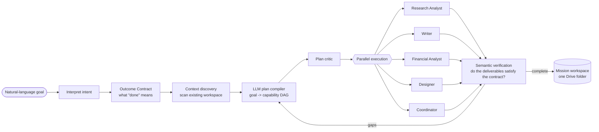

# NEXORA

**One goal in. A verified workspace of real work out.**

NEXORA is an autonomous **goal compiler**. You give it a messy, real-world
objective in plain language — *"I'm in New York tomorrow, what should I see? Put
together a guide, a slide deck and a budget"* or *"read today's email and brief me
on what matters"* — and it plans the work, does it in the background across a
team of specialist workers, **checks that the result actually satisfies the
goal**, repairs the gaps, and hands back one Google Drive folder containing the
finished deliverables.

It is built for the **Taskmaster** track of the All Things Agentic Hackathon:
high‑value autonomous execution of multi‑step work, not a chat box.

- **Live demo:** _add your Cloud Run URL here_
- **Demo video:** _add your YouTube link here_
- **Architecture:** [docs/ARCHITECTURE.md](docs/ARCHITECTURE.md)

---

## The friction

Knowledge work is full of tasks that are *individually* simple and *collectively*
exhausting: research something, write it up, build the spreadsheet, make the
deck, draft the email, schedule the meeting, file it all somewhere sensible, and
double‑check nothing was missed. Each step is a context switch. NEXORA collapses
the whole arc into a single instruction and gives you back verified output.

---

## What it does



1. **Interpret** the goal into a structured intent.
2. **Write an Outcome Contract** — a formal, checkable definition of success
   (deliverables, evidence needed, constraints). Generated by Gemini.
3. **Discover context** already in your workspace so it doesn't reinvent what
   exists.
4. **Compile a plan**: Gemini turns the goal + contract into a dependency graph
   of *capabilities* (`web.research`, `docs.create`, `sheets.create`,
   `slides.create`, `imagen.generate_image`, `veo.generate_video`,
   `lyria.generate_audio`, `calendar.create_event`, …). The plan is validated
   against a capability registry and the contract; an untrusted LLM never picks
   raw API calls directly.
5. **Critique** the plan for safety and coverage.
6. **Execute** in parallel. Each capability is handled by a **persona** — a
   specialist system prompt (Research Analyst, Writer, Financial Analyst,
   Designer, Coordinator, Visual Designer). Every deliverable's *content* is
   written by Gemini from the gathered evidence — real itineraries, real budget
   line items, real slide copy — not templated stubs.
7. **Verify semantically**: Gemini reads the produced artifacts and decides,
   per contract deliverable, whether it is `SATISFIED`, `PARTIAL`, or `MISSING`.
8. **Replan** the gaps (bounded to 2 cycles) and re‑execute.
9. **Deliver**: everything is filed into a single Drive folder (LIVE) or an
   in‑memory workspace (MOCK).

Throughout: a **Content Firewall** scans every piece of external text (emails,
web results) for prompt‑injection before it can reach a model; a **policy
engine** gates risky actions (sending email, anything irreversible) behind human
approval; every action writes an **ActionReceipt** and an **audit entry**.

---

## Meets the hackathon requirements

| Requirement | How NEXORA meets it |
| --- | --- |
| **Gemini 3.5 or newer** | `NEXORA_MODEL_T2=gemini-3.5-flash` drives every reasoning step (contract, plan compiler, content composer, semantic verifier, research synthesis, vision). |
| **A Google agent framework** | The **Google GenAI SDK** (`google-genai`) is the transport for all model calls (`nexora/core/llm_client.py`) and for Google‑Search‑grounded research (`nexora/core/web_research.py`). |
| **A Google Cloud service** | **Cloud Run** (service), **Firestore** (durable mission state, `NEXORA_REPO=firestore`), **Cloud Tasks** (one durable task per plan node, `NEXORA_DISPATCHER=cloud`), **Vertex AI** (Gemini, Imagen, Veo, Lyria). |
| **Multimodal / extra models (bonus)** | Imagen (images), Veo (video), Lyria (audio), Gemini Vision (screenshot analysis) — invoked when the contract calls for them. |
| **Hosted + reproducible** | `Dockerfile` + `infrastructure/deploy.sh` (one command) + Terraform. |

---

## Quickstart (local)

**Prerequisites:** Python 3.12, Node 20, a Gemini API key
([aistudio.google.com](https://aistudio.google.com/apikey)).

```bash
# 1. API
cd apps/api
python -m venv venv && source venv/bin/activate      # Windows: venv\Scripts\activate
pip install -r requirements.txt
cp .env.example .env                                  # then put your GEMINI_API_KEY in it

# 2. Run the API (from the repo root on PYTHONPATH)
cd ../..
PYTHONPATH=. apps/api/venv/bin/python -m uvicorn nexora.main:app --reload --port 8000 --app-dir apps/api

# 3. Frontend (new terminal)
cd apps/web
npm install
npm run dev            # http://localhost:3000
```

Open http://localhost:3000, pick a scenario chip or type a goal, and hit
**Launch**. `MOCK` mode needs only the Gemini key; `LIVE` mode also needs Google
OAuth (below).

Run the test suite (fully hermetic, no keys needed):

```bash
cd apps/api && PYTHONPATH=../.. venv/bin/python -m pytest -q
```

### LIVE mode (real Google Workspace)

1. Create an OAuth 2.0 Client (Web) in Google Cloud console, redirect URI
   `http://localhost:8000/api/v1/auth/callback`.
2. Put `GOOGLE_CLIENT_ID` / `GOOGLE_CLIENT_SECRET` in `apps/api/.env`, set
   `EXECUTION_MODE=LIVE`.
3. Visit `http://localhost:8000/api/v1/auth/google`, approve the scopes.
4. Launch a mission — deliverables now land in a real Drive folder.

---

## Deploy to Google Cloud

```bash
PROJECT_ID=your-project GEMINI_API_KEY=xxxxx ./infrastructure/deploy.sh
```

This enables the APIs, creates the Firestore database, the `nexora-workers`
Cloud Tasks queue, an Artifact Registry repo, a least‑privilege service account,
stores the Gemini key in Secret Manager, builds the image with Cloud Build, and
deploys to Cloud Run — then wires `NEXORA_WORKER_URL` back to the service so
node tasks are dispatched durably. Terraform equivalent in
[infrastructure/terraform](infrastructure/terraform).

The deployed service defaults to `NEXORA_LLM_BACKEND=vertex` (Gemini through
Vertex AI, no API key on the request path), `NEXORA_REPO=firestore`,
`NEXORA_DISPATCHER=cloud`.

---

## Repository layout

```
apps/
  api/                     FastAPI service — the mission engine
    nexora/
      core/                contract, compiler, composer, verifier, firewall,
                           policy engine, llm_client, task_dispatcher, repository
      agents/              node_executor, supervisor, critic, replanner, interpreter
      providers/           MOCK / LIVE (Google Workspace) / ACME_LABS / REPLAY
      main.py              REST + WebSocket API
    tests/                 127 hermetic tests (test_phase*.py)
  web/                     Next.js Command Center UI
packages/core/models.py    shared Pydantic domain models
infrastructure/            Dockerfile context, deploy.sh, Terraform
docs/
  ARCHITECTURE.md          the diagram + component walk-through
  adr/                     65 architecture decision records
```

Key files to read first: `apps/api/nexora/main.py` (the orchestration in
`create_mission`), `apps/api/nexora/core/composer.py` (how deliverables get real
content), `apps/api/nexora/agents/supervisor.py` (semantic verification +
adaptive replan), `apps/api/nexora/core/security.py` (the firewall).

---

## What we're proud of

- **Success is a contract, not a status code.** Most agents stop at "all steps
  ran." NEXORA generates a checkable definition of done and has a model verify
  the *artifacts* against it, then repairs what's short.
- **The deliverables are real.** A Gemini "composer" writes the document body,
  the slide copy and the budget rows from the gathered evidence — the New York
  demo produces a costed day‑by‑day itinerary, not a placeholder.
- **Untrusted‑input discipline.** Every external string is firewall‑scanned for
  injection before a model sees it; the demo inbox contains a malicious email
  and you can watch it get quarantined.
- **Degrades instead of failing.** No Gemini key → deterministic fallbacks. No
  Tavily key → Google‑Search‑grounded research. Provider missing a method →
  graceful fallback. The mission always reaches a truthful terminal state.
- **Real separation of concerns.** State machine, event bus, task dispatcher,
  repository and provider are all swappable behind interfaces; local dev and
  Cloud Run run the *same* code with different env.

## Roadmap / known limits

- Personas are specialist prompts, not independently addressable ADK agents —
  next step is to run them under the ADK runner.
- `web.research` grounding uses Gemini + Google Search; a dedicated search
  vendor would broaden coverage.
- Memory is scoped and substring‑matched; vector retrieval is the planned
  upgrade.
