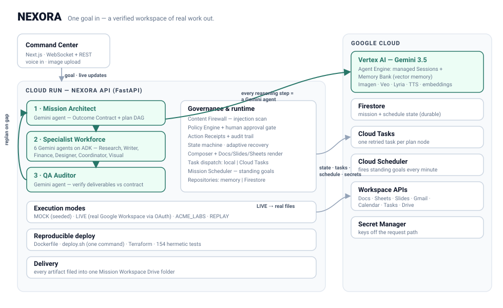
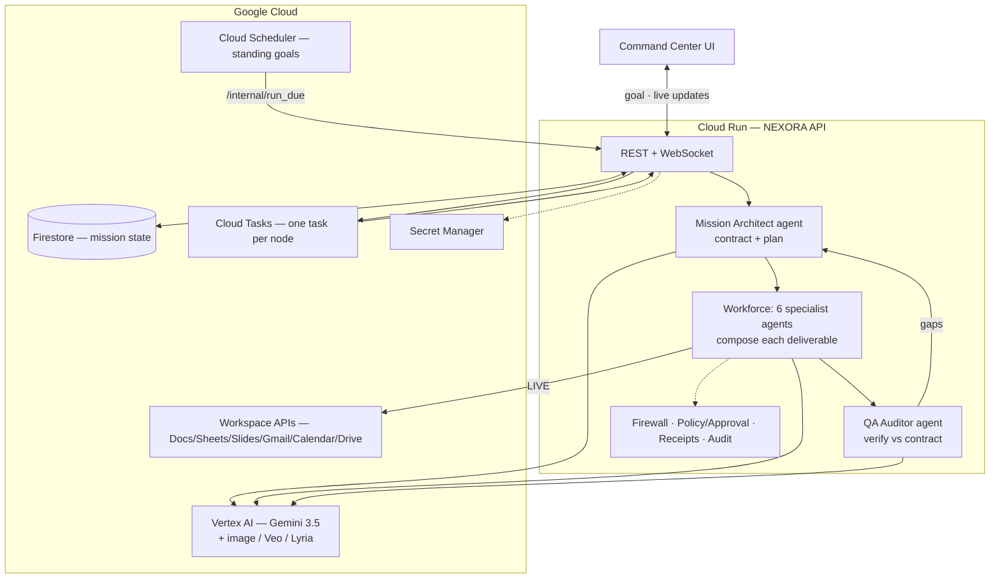

# NEXORA architecture

One FastAPI service (the **mission engine**) + a Next.js **Command Center** UI.
The engine runs identically on a laptop and on Cloud Run; environment variables
decide what is real.

## One-glance diagram

Mermaid source

## Why this stack

| Choice | Reason |
| --- | --- |
| **Cloud Run** | stateless HTTP service, scale‑to‑zero, one image for API + node worker. |
| **Firestore** | the `Mission` aggregate is one JSON document; no schema migrations; serverless; `FIRESTORE_EMULATOR_HOST` gives a zero‑cost local mode. |
| **Cloud Tasks** | each plan node is an independently‑retried unit of work; a mission waiting on approval simply has no queued task. |
| **Cloud Scheduler** | fires `/internal/run_due` every minute so standing goals span days/weeks without a long‑lived process. |
| **Vertex AI + ADK** | Gemini as first‑class agents with a runner, sessions and tool plumbing; Vertex keeps the key off the request path in prod. |
| **GenAI SDK** | one client for Gemini API *and* Vertex; native Google Search grounding and image generation. |

## Request lifecycle

`POST /api/v1/missions` runs the planning arc, then the runtime executes:

| Phase | Component | Output |
| --- | --- | --- |
| INTERPRETING | `agents/interpreter.py` | `MissionIntent` |
| — | `core/contract.py` (Architect agent) | `OutcomeContract` |
| — | `core/context_discovery.py` | `ContextBundle` |
| PLANNING | `core/llm_compiler.py` (Architect agent) → `core/compiler.py` fallback | `MissionNode` DAG |
| CRITICIZING | `agents/critic.py` | approve / reject |
| EXECUTING | `core/runtime.py` + `agents/node_executor.py` + `core/composer.py` (specialist agents) + `providers/formatting.py` | formatted artifacts, receipts |
| VERIFYING | `agents/supervisor.py` + `core/semantic_verifier.py` (Auditor agent) | `SemanticVerificationReport` |
| REPLANNING | `core/adaptive_replanner.py` | follow‑up nodes (≤2 cycles) |
| terminal | `core/state_machine.py` | COMPLETED / PARTIAL_SUCCESS / FAILED + health |

## Agent runtime (`core/adk_runtime.py`)

`try_run_agent(role, instruction, task)` builds a `google.adk` `LlmAgent`
(instruction = the persona system prompt) and runs one turn through an ADK
`Runner`. When `NEXORA_AGENT_ENGINE` is set the Runner is backed by **Vertex AI
Agent Engine** — `VertexAiSessionService` + `VertexAiMemoryBankService`;
otherwise an in‑process `InMemoryRunner`. On any failure it returns `None` and
the caller drops to the Unified LLM Client and then to deterministic templates —
so the hermetic test suite never touches ADK or Agent Engine.

## Key decisions

- **Capabilities, not APIs.** The Architect plans over ~26 semantic capabilities
  with cost/risk/reversibility metadata; the plan is untrusted and validated.
- **The Outcome Contract is the spine** — generated once, consumed by the
  compiler, the critic, the composer and the verifier.
- **Composer separates content from delivery** — Gemini writes it, the provider
  renders it, so MOCK and LIVE produce the same substance.
- **Everything external is untrusted** — `core/security.py` quarantines injection
  before it reaches a prompt.
- **Swappable everything** — repository, dispatcher, scheduler, provider, model
  backend are interfaces with local + Google Cloud implementations.
- 52 ADRs in [`adr/`](adr) record the reasoning.

## Execution modes

| Mode | Providers | Use |
| --- | --- | --- |
| `MOCK` | seeded in‑memory workspace | demo / CI — Gemini key only |
| `LIVE` | real Google Workspace via OAuth | production deliverables in Drive |
| `ACME_LABS` | scripted benchmark sandbox | deterministic evaluation |
| `REPLAY` | replays a past mission's artifacts | zero‑mutation regression |
