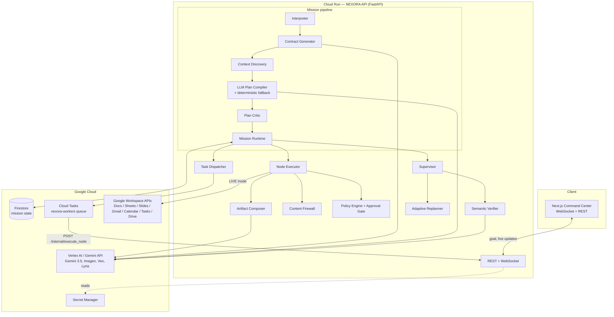

# NEXORA architecture

NEXORA is a single FastAPI service (the **mission engine**) plus a Next.js
**Command Center** UI. The engine runs identically on a laptop and on Cloud Run;
only environment variables change what's real.

## System diagram

## Request lifecycle

`POST /api/v1/missions` (`create_mission` in `main.py`) runs the synchronous
planning arc, then hands execution to the runtime:

| Phase | Component | Output |
| --- | --- | --- |
| INTERPRETING | `agents/interpreter.py` | `MissionIntent` |
| — | `core/contract.py` | `OutcomeContract` (Gemini) |
| — | `core/context_discovery.py` | `ContextBundle` |
| PLANNING | `core/llm_compiler.py` → `core/compiler.py` fallback | `MissionNode` DAG |
| CRITICIZING | `agents/critic.py` | approve / reject |
| EXECUTING | `core/runtime.py` + `agents/node_executor.py` | artifacts, receipts |
| VERIFYING | `agents/supervisor.py` + `core/semantic_verifier.py` | `SemanticVerificationReport` |
| REPLANNING | `core/adaptive_replanner.py` | follow‑up nodes (≤2 cycles) |
| COMPLETED / PARTIAL_SUCCESS / FAILED | `core/state_machine.py` | terminal state + health |

Each node is dispatched through the **Task Dispatcher**:

- **local** (`LocalTaskDispatcher`) — an `asyncio` task; used in dev and tests.
- **cloud** (`CloudTasksDispatcher`) — one Cloud Tasks HTTP task per node,
  hitting `POST /internal/execute_node`, retried by the queue. A mission that is
  waiting for human approval or is spread over hours simply has no in‑flight
  task until it's unblocked — that's the long‑running story.

## Key design decisions

- **Capabilities, not APIs.** The planner reasons over a registry of ~26
  semantic capabilities with cost/risk/reversibility metadata
  (`core/capability_network.py`). The LLM's plan is untrusted and every node is
  validated against the registry and the constitution before execution.
- **The Outcome Contract is the spine.** It's generated once, then consumed by
  the compiler (what to plan), the critic (does the plan cover it), the composer
  (what to write), and the verifier (is it actually done).
- **Composer separates content from delivery.** `core/composer.py` produces the
  real document / slide / spreadsheet content from evidence; the provider only
  persists it. MOCK and LIVE therefore produce the same substance.
- **Everything external is untrusted.** `core/security.py` scans Gmail/Drive/web
  text for injection signatures and quarantines malicious payloads before they
  reach a prompt.
- **Swappable everything.** `MissionRepository`, `TaskDispatcher`, `EventBus`,
  `WorkspaceProvider`, `LLMClient` are all interfaces with a local and a cloud
  implementation.
- 65 ADRs in [`docs/adr`](adr) record the reasoning in detail.

## Execution modes

| Mode | Providers | Use |
| --- | --- | --- |
| `MOCK` | seeded in‑memory workspace | demo / CI — needs only a Gemini key |
| `LIVE` | real Google Workspace via OAuth | production deliverables in Drive |
| `ACME_LABS` | scripted benchmark sandbox | deterministic evaluation |
| `REPLAY` | replays a past mission's artifacts | zero‑mutation regression checks |
